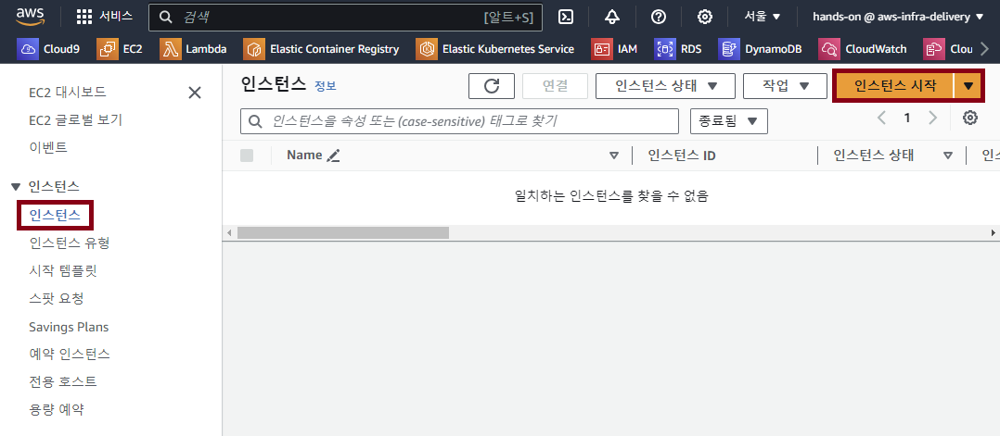

# Creating Bastion Server

### 1. EC2 메인 콘솔 화면으로 이동
- **인스턴스 리소스 탭 → '인스턴스 시작' 버튼 클릭**

### 2. EC2 인스턴스 설정 정보 입력 및 생성
- 아래 인스턴스 자원 명세서를 참고하여 정보 입력
    - **이름:** *lab-edu-ec2-bastion*
    - **AMI:** *Amazon Linux 2023*
    - **인스턴스 유형:** *t3.micro*
    - **키 페어:** '새 키 페어 생성' 버튼 클릭 → 키 페어 이름: *lab-edu-key-ec2* → '키 페어 생성' 버튼 클릭

    

    - **네트워크 설정:**
        - '편집' 버튼 클릭
        - 네트워크: *lab-edu-vpc-ap-01*
        - 서브넷: *lab-edu-sub-pub-01*
        - 퍼블릭 IP 자동 할당: 활성화
        - 방화벽(보안 그룹): '보안 그룹 생성'
        - 보안 그룹 이름: *lab-edu-sg-bastion*
        - 보안 그룹 규칙1
            - 유형: ssh
            - 소스 유형: 내 IP
        - '보안 그룹 규칙 추가' 버튼 클릭
        - 보안 그룹 규칙2
            - 유형: http
            - 소스 유형: 내 IP

    

- '인스턴스 시작' 버튼 클릭

### 2. Putty 다운로드
- **다운로드 URL:** https://www.chiark.greenend.org.uk/~sgtatham/putty/latest.html
- MSI (Windows Installer) 64-bit x86 다운로

    
- MSI 파일 실행 → 'next' 버튼 클릭 → 'next' 버튼 클릭 → 'Install' 버튼 클릭 → 'Finish' 버튼 클릭

### 3. Bastion 서버 접속

# Creating Web Server

# Creating Cloud9 Server
