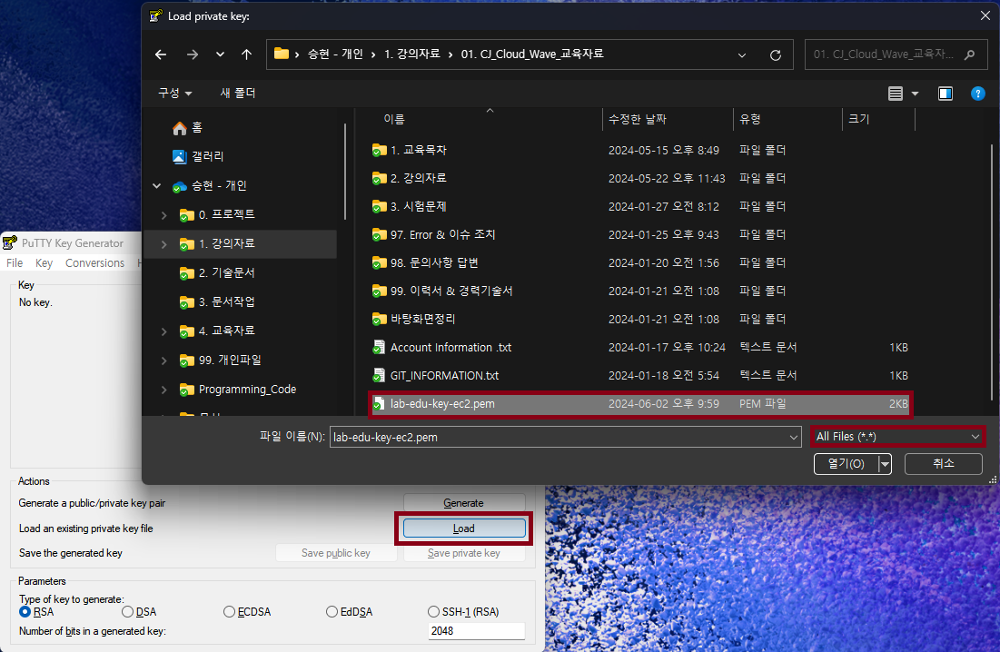
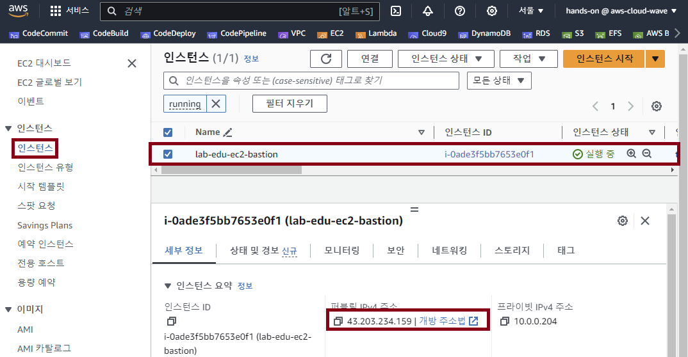
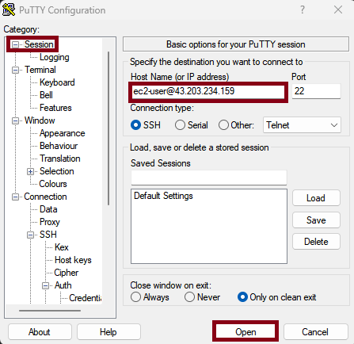
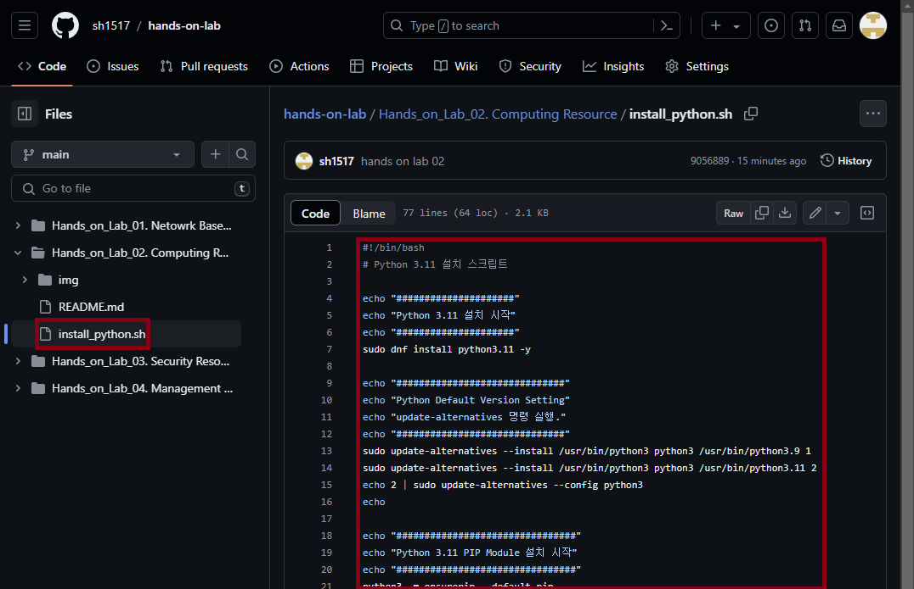
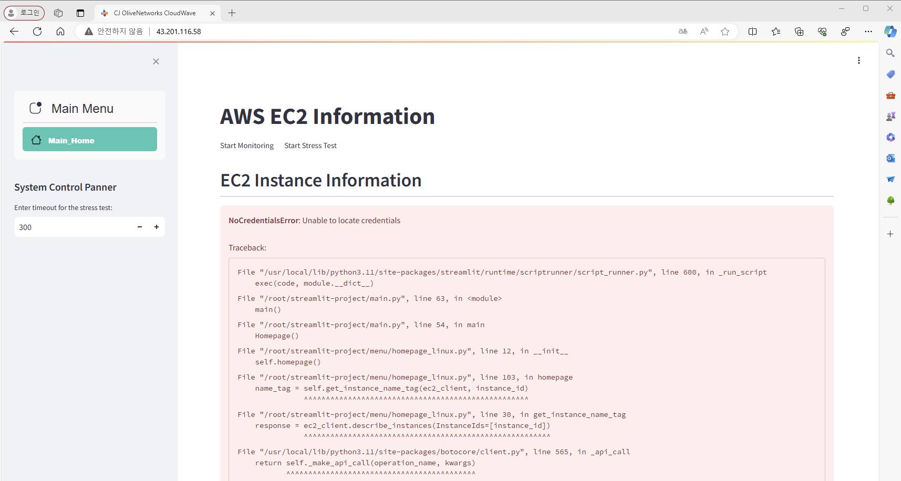
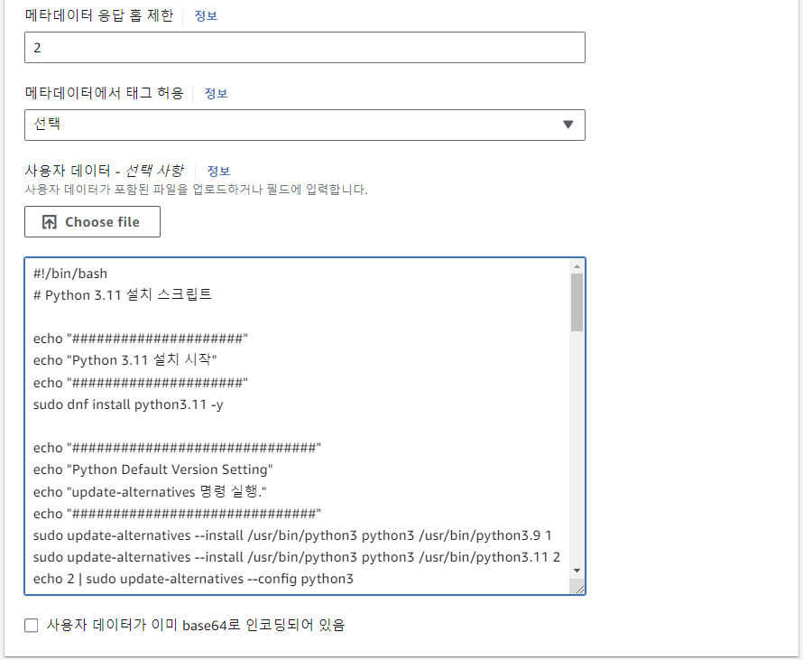
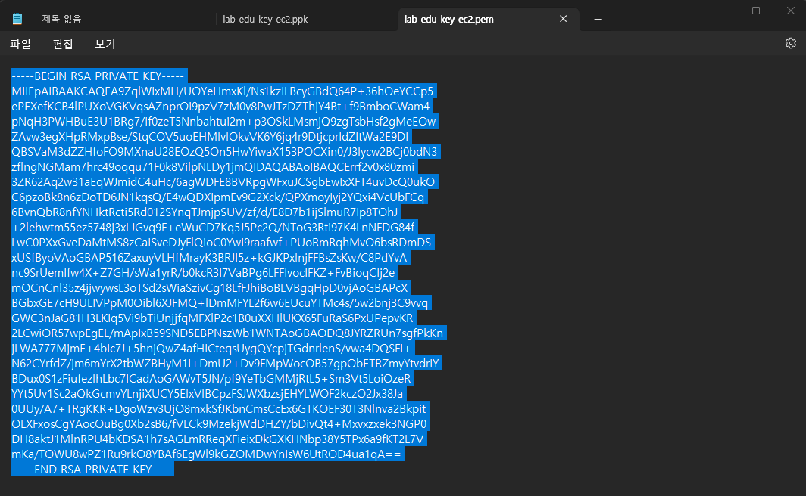
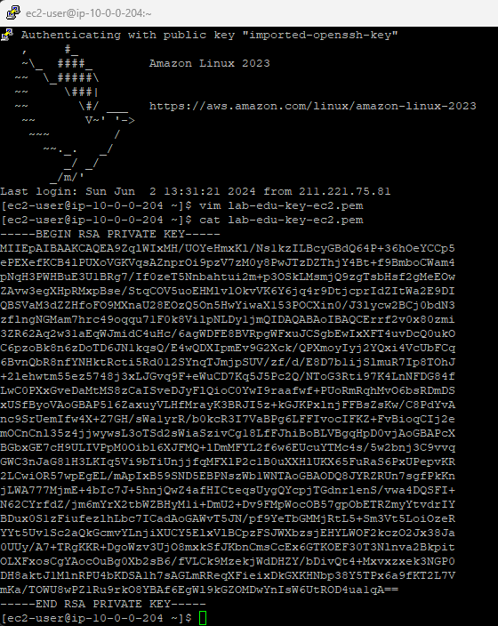
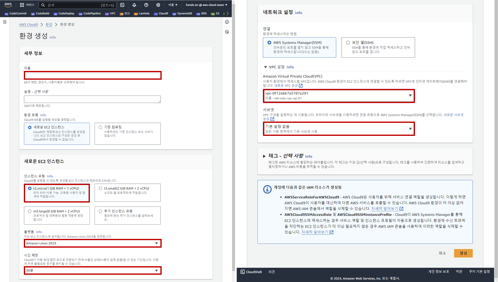
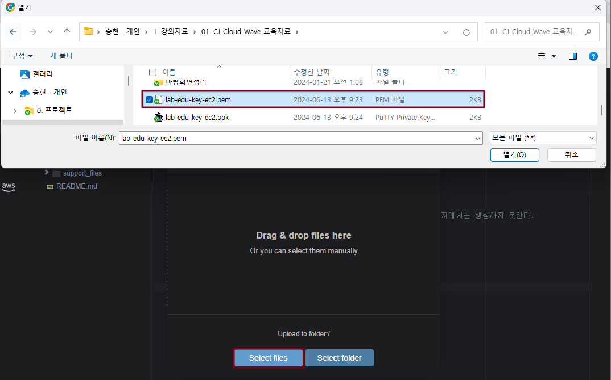

# Bastion Server 생성

### 1. EC2 메인 콘솔 화면으로 이동

- **인스턴스 리소스 탭 → '인스턴스 시작' 버튼 클릭**

    

### 2. EC2 인스턴스 설정 정보 입력 및 생성

- 아래 인스턴스 자원 명세서를 참고하여 정보 입력

    - **이름:** *lab-edu-ec2-bastion*

    - **AMI:** *Amazon Linux 2023*

    - **인스턴스 유형:** *t3.micro*

    - **키 페어:** '새 키 페어 생성' 버튼 클릭 → 키 페어 이름: *lab-edu-key-ec2* → '키 페어 생성' 버튼 클릭

        

    - **네트워크 설정:**

        - '편집' 버튼 클릭

        - 네트워크: *lab-edu-vpc-ap-01*

        - 서브넷: *lab-edu-sub-pub-01*

        - 퍼블릭 IP 자동 할당: 활성화

        - 방화벽(보안 그룹): '보안 그룹 생성'

        - 보안 그룹 이름: *lab-edu-sg-bastion*

        - 보안 그룹 규칙1

            - 유형: ssh

            - 소스 유형: 내 IP

        - '보안 그룹 규칙 추가' 버튼 클릭

        - 보안 그룹 규칙2

            - 유형: http

            - 소스 유형: 내 IP

                

- '인스턴스 시작' 버튼 클릭

### 3. Putty 다운로드

- **다운로드 URL:** https://www.chiark.greenend.org.uk/~sgtatham/putty/latest.html

- MSI (Windows Installer) 64-bit x86 다운로드

    

- MSI 파일 실행 → 'next' 버튼 클릭 → 'next' 버튼 클릭 → 'Install' 버튼 클릭 → 'Finish' 버튼 클릭

### 4. Bastion 서버 접속

- 키 페어 확장자 변경 (pem → ppk)

    - PuTTYgen 실행 

        

    - 'Load' 버튼 클릭 → pem 키 파일 다운로드 받은 폴더로 이동 → 확장자 명을 'All Files (*.*)로 변경 → pem 키 파일 선택

        

    - 'save private key' 버튼 클릭 → '예' 버튼 클릭 → 파일 이름 'lab-edu-key-ec2' 입력 → '저장' 버튼 클릭
    
        
    
        

- EC2 접속 정보 확인: 인스턴스 메인 콘솔 화면 이동 → '인스턴스' 탭으로 이동 → 'lab-edu-ec2-bastion' 선택 → 퍼블릭 IPv4 주소 복사

    

- PuTTY 실행 및 접속

    - Putty 실행 → SSH 클릭 → Auth 클릭 → Credentials 클릭 → Browser 클릭 → 'lab-edu-key-ec2.ppk' 선택

        

    - Session 클릭 → Host Name: 'ec2-user@*{BASTION_SERVER_PUBLIC_IP}* 입력 → 'Open' 버튼 클릭

        

### 5. Web Service 구성

- "Hands_on_Lab_02. Computing Resource/install_python.sh" 파일 내용 복사

    

- Bastion 서버 접속 → VIM Editor 이용 내용 입력

    

- 스크립트 실행 

    ```bash
    chmod +x install_python.sh
    ./install_python.sh
    ```

- 웹 서비스 접속 테스트 (Bastion 서버 Public IP로 브라우저에서 접속)

    
    ***※ Bastion Server에는 EC2 관련 데이터 접근을 위한 IAM 권한이 없어 에러 페이지 반환***

<br>

# Web Server 생성

### 1. EC2 메인 콘솔 화면으로 이동

- **인스턴스 리소스 탭 → '인스턴스 시작' 버튼 클릭**

### 2. EC2 인스턴스 설정 정보 입력 및 생성

- 아래 인스턴스 자원 명세서를 참고하여 정보 입력

    - **이름:** *lab-edu-ec2-web*

    - **AMI:** *Amazon Linux 2023*

    - **인스턴스 유형:** *t3.micro*

    - **키 페어:** *lab-edu-key-ec2*

    - **네트워크 설정:**

        - '편집' 버튼 클릭

        - 네트워크: *lab-edu-vpc-ap-01*

        - 서브넷: *lab-edu-sub-pri-01*

        - 퍼블릭 IP 자동 할당: 비활성화

        - 방화벽(보안 그룹): '보안 그룹 생성'

        - 보안 그룹 이름: *lab-edu-sg-web*

        - 보안 그룹 규칙1

            - 유형: ssh

            - 소스 유형: 10.0.0.0/16

        - '보안 그룹 규칙 추가' 버튼 클릭

        - 보안 그룹 규칙2

            - 유형: http

            - 소스 유형: 10.0.0.0/16

        - 고급 세부 정보 확장

            - 사용자 데이터: "Hands_on_Lab_02. Computing Resource/install_python.sh" 파일 내용 복사
            
                

### 3. Web 서버 접속

- Bastion 서버 접속

    - Putty 실행 → SSH 클릭 → Auth 클릭 → Credentials 클릭 → Browser 클릭 → 'lab-edu-key-ec2.ppk' 선택 

    - Session 클릭 → Host Name: 'ec2-user@*{BASTION_SERVER_PUBLIC_IP}* 입력 → 'Open' 버튼 클릭

-   pem 키 페어 Bastion 서버에 저장

    - pem 파일 notepad로 실행 → 전체 복사

        

    - Bastion 서버에서 VIM Editor 이용 파일로 내용 저장 (파일명: *lab-edu-key-ec2.pem*)

        

    - pem 키 파일 권한 설정

        ```bash
        chmod 600 lab-edu-key-ec2.pem
        ```

- EC2 접속 정보 확인: 인스턴스 메인 콘솔 화면 이동 → '인스턴스' 탭으로 이동 → 'lab-edu-ec2-web' 선택 → 프라이빗 IPv4 주소 복사

- Web 서버 접속

    - Bastion 서버를 접속 한 PuTTY 콘솔 화면에서 다음 명령어 실행

        ```bash
        ssh -i lab-edu-key-ec2.pem ec2-user@*{WEB_SERVER_PRIVATE_IP}*
        ```

        
    
    - init script 실행 결과 확인

        ```bash
        ps -ef | grep streamlit
        ```
<br>

# Cloud9 생성

### 1. cloud9 메인 콘솔 화면으로 이동

- **'환경 생성' 버튼 클릭**

    

### 2. cloud9 설정 정보 입력 및 생성

- 아래 cloud9 자원 명세서를 참고하여 정보 입력

    - **이름:** *lab-edu-cloud9-workspace*

    - **인스턴스 유형:** *t2.micro*

    - **플랫폼:** *Amazon Linux 2023*

    - **시간 제한:** *1시간*

    - **네트워크 설정:**

        - 'VPC 설정' 버튼 클릭

        - VPC: *lab-edu-vpc-ap-01*

        - 서브넷: *lab-edu-sub-pub-02*
        
            

### 3. cloud9 서버 접속

- '열림' 버튼 클릭

    

- 'Welcome' 페이지 종료 → 'Command Terminal' 화면 상단으로 Drag & Drop

    

### 4. Workspace Settings

- Workspace 폴더 생성

    ```bash
    mkdir cloud-wave-workspace
    cd cloud-wave-workspace
    ```

- Git Local 저장소 초기화 및 원격 저장소 추가

    ```bash
    git config --global init.defaultBranch main
    git init
    git remote add origin https://github.com/sh1517/streamlit-project.git
    ```

- Sparse Checkout 활성화 및 패턴 설정

    ```bash
    git config core.sparseCheckout true
    echo "images/" >> .git/info/sparse-checkout
    echo "scripts/" >> .git/info/sparse-checkout
    echo "support_files/" >> .git/info/sparse-checkout
    ```

- Remote 저장소에서 필요한 폴더만 다운로드

    ```bash
    git pull origin main
    ```

### 5. EC2 Pem Key 업로드

- Cloud9 IDE 화면 → 'File' 버튼 클릭 → 'Upload Local Files...' 버튼 클릭

    

- 'Select files' 버튼 클릭 → pem 키 파일 다운로드 받은 폴더로 이동 → pem 키 선택 → '열기' 버튼 클릭

    

- SSH Config 설정

    - Pem Key 파일 폴더 이동

        ```bash
        cd ~/environment/
        mv ./lab-edu-key-ec2.pem ~/.ssh/
        ```

    - config 파일 생성 

        ```bash
        touch config
        ```

    - Cloud9 IDE 좌측 패널의 'config' 파일 더블 클릭 → 설정 값 입력

        

        ```bash
        Host bastion
          HostName [BASTION_SERVER_PRIVATE_IP]
          User ec2-user
          IdentityFile ~/.ssh/lab-edu-key-ec2.pem

        Host web-server
          HostName [WEB_SERVER_PRIVATE_IP]
          User ec2-user
          IdentityFile ~/.ssh/lab-edu-key-ec2.pem
        ```

    - Bastion, WEB Server Private IP 주소 확인 → SSH config 설정 값 수정 → 저장 ***(Ctrl + S)***

        ```bash
        Host bastion
          HostName 10.0.0.105
          User ec2-user
          IdentityFile ~/.ssh/lab-edu-key-ec2.pem

        Host web-server
          HostName 10.0.40.128
          User ec2-user
          IdentityFile ~/.ssh/lab-edu-key-ec2.pem
        ```

    - config 파일 폴더 이동

        ```bash
        cd ~/environment/
        mv ./config ~/.ssh/
        ```

### 6. Bastion, Web Server 접속 테스트

- Bastion 서버 접속 테스트

    ```bash
    chmod 600 ~/.ssh/lab-edu-key-ec2.pem 
    ssh bastion
    ```

- Web 서버 접속 테스트

    - Cloud IDE 새로운 Terminal 생성: '＋' 버튼 클릭 → 'New Termianl' 버튼 클릭 

        

    - ssh 명령어 실행

        ```bash
        ssh web-server
        ```


