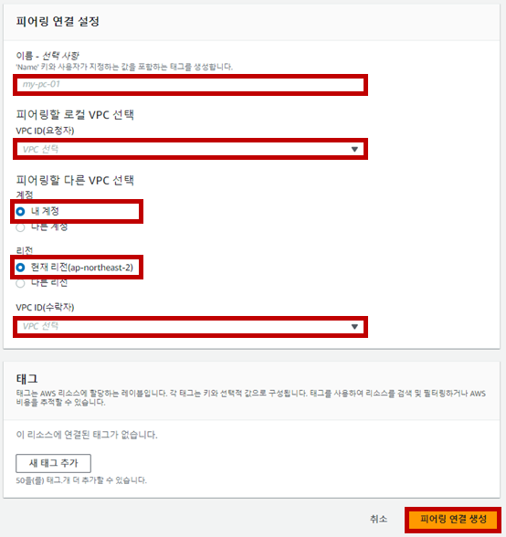

# 서울 리전 ↔ 서울 리전 VPC Peering

### 1. VPC Peering Resource 생성

- **VPC 콘솔 메인 화면 → 피어링 연결 리소스 탭 → "피어링 연결 생성" 버튼 클릭**

- VPC Peering 생성 정보 입력 → '피어링 연결 생성' 버튼 클릭

    - 이름: lab-edu-peering-ap01-ap02

    - VPC ID(요청자):lab-edu-vpc-ap-01

    - 계정: 내 계정

    - 리전: 현재 리전

    - VPC ID(수락자): lab-edu-vpc-ap-02

        

- 피어링 연결 리소스 탭으로 이동 → "lab-edu-peering-ap01-ap02" 리소스 선택 → '작업' 버튼 클릭 → '요청 수락' → '요청 수락'

    

### 2. Routing Table 수정

- **VPC 콘솔 메인 화면 → 라우팅 테이블 탭 → "lab-edu-rtb-pri-01" 선택 → '라우팅' 탭 → '라우팅 편집' 버튼 클릭**

- 라우팅 테이블 경로 생성 정보 입력

    - '라우팅 추가' 버튼 클릭

    - 대상: 10.10.0.0/16

    - 대상: 피어링 연결 (lab-edu-peering-ap01-ap02)

    - '변경 사항 저장' 버튼 클릭

- **VPC 콘솔 메인 화면 → 라우팅 테이블 탭 → "lab-edu-rtb-2nd-pri-01" 선택 → '라우팅' 탭 → '라우팅 편집' 버튼 클릭**

- 라우팅 테이블 경로 생성 정보 입력

    - '라우팅 추가' 버튼 클릭

    - 대상: 10.0.0.0/16

    - 대상: 피어링 연결 (lab-edu-peering-ap01-ap02)

    - '변경 사항 저장' 버튼 클릭

### 3. Network 통신 테스트

- **EC2 메인 콘솔 화면으로 이동 → 인스턴스 리소스 탭 → 'lab-edu-ec2-network-2nd-ap' 선택 → Private IP 주소 복사**

- Cloud9 IDE Terminal 화면으로 이동 → ssh 명령어 실행

    ```bash
    ssh web-server
    ```

- ICMP 통신 테스트 진행

    ```bash
    ping {2ND_VPC_NETWORK_SERVER_PRIVATE_IP}
    PING 10.10.40.140 (10.10.40.140) 56(84) bytes of data.
    64 bytes from 10.10.40.140: icmp_seq=1 ttl=255 time=0.451 ms
    64 bytes from 10.10.40.140: icmp_seq=2 ttl=255 time=0.473 ms
    64 bytes from 10.10.40.140: icmp_seq=3 ttl=255 time=0.384 ms
    64 bytes from 10.10.40.140: icmp_seq=4 ttl=255 time=0.536 ms
    ```
<br><br>


# 서울 리전 ↔ 프랑크푸르트 리전 VPC Peering

### 1. 프랑크푸르트 리전 VPC ID 확인

- **프랑크푸르트 리전으로 이동 → VPC 콘솔 메인 화면 → VPC 리소스 탭 → "lab-edu-vpc-eu-01" 선택 → 세부화면의 'VPC ID' 복사**

    

### 2. VPC Peering Resource 생성

- **VPC 콘솔 메인 화면 → 피어링 연결 리소스 탭 → "피어링 연결 생성" 버튼 클릭**

- VPC Peering 생성 정보 입력 → '피어링 연결 생성' 버튼 클릭

    - 이름: lab-edu-peering-ap01-eu01

    - VPC ID(요청자):lab-edu-vpc-ap-01

    - 계정: 내 계정

    - 리전: 다른 리전 → ***eu-central-1***

    - VPC ID(수락자): {프랑크푸르트_VPC_ID}

### 3. VPC Peering 수락

- **프랑크푸르트 리전으로 이동 → VPC 콘솔 메인 화면 → 피어링 연결 리소스 탭**

- 수락 대기 상태의 Peering 리소스 선택 → '작업' → '요청 수락' → '요청 수락

### 4. Routing Table 수정

- **서울 리전으로 이동 → VPC 콘솔 메인 화면 → 라우팅 테이블 탭 → "lab-edu-rtb-pri-01" 선택 → '라우팅' 탭 → '라우팅 편집' 버튼 클릭**

- 라우팅 테이블 경로 생성 정보 입력

    - '라우팅 추가' 버튼 클릭

    - 대상: 10.30.0.0/16

    - 대상: 피어링 연결 (lab-edu-peering-ap01-eu01)

    - '변경 사항 저장' 버튼 클릭

- **프랑크푸르트 리전으로 이동 → VPC 콘솔 메인 화면 → 라우팅 테이블 탭 → "lab-edu-rtb-eu-pri-01" 선택 → '라우팅' 탭 → '라우팅 편집' 버튼 클릭**

- 라우팅 테이블 경로 생성 정보 입력

    - '라우팅 추가' 버튼 클릭

    - 대상: 10.0.0.0/16

    - 대상: 피어링 연결 (lab-edu-peering-ap01-eu01)

    - '변경 사항 저장' 버튼 클릭

### 5. Network 통신 테스트

- **프랑크푸르트 리전으로 이동 → EC2 메인 콘솔 화면 → 인스턴스 리소스 탭 → 'lab-edu-ec2-network-eu' 선택 → Private IP 주소 복사**

- Cloud9 IDE Terminal 화면으로 이동 → ssh 명령어 실행

    ```bash
    ssh web-server
    ```

- ICMP 통신 테스트 진행

    ```bash
    ping {FRANKFURT_NETWORK_SERVER_PRIVATE_IP}
    PING 10.30.40.64 (10.30.40.64) 56(84) bytes of data.
    64 bytes from 10.30.40.64: icmp_seq=1 ttl=127 time=225 ms
    64 bytes from 10.30.40.64: icmp_seq=2 ttl=127 time=225 ms
    64 bytes from 10.30.40.64: icmp_seq=3 ttl=127 time=225 ms
    64 bytes from 10.30.40.64: icmp_seq=4 ttl=127 time=225 ms
    ```
<br><br>


# 전이적 VPC Peering Network 통신 테스트

### 1. 프랑크푸르트 리전 Network Server 접속

- 프랑크푸르트 리전으로 이동 → EC2 콘솔 메인 화면 → 인스턴스 리소스 탭 → 'lab-edu-ec2-network-us' 선택 → '연결' 버튼 클릭

- 'Session Manager' 탭으로 이동 → '연결' 버튼 클릭

### 2. Network 통신 테스트

```bash
ping {2ND_VPC_NETWORK_SERVER_PRIVATE_IP}
PING 10.10.40.140 (10.10.40.140) 56(84) bytes of data.
^C
--- 10.10.40.140 ping statistics ---
312 packets transmitted, 0 received, 100% packet loss, time 323451ms