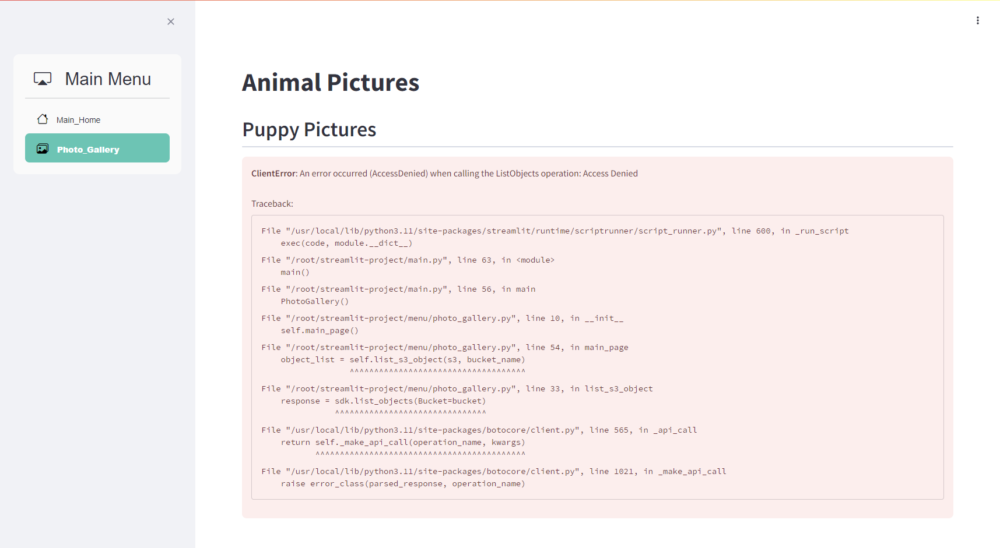

# Amazon S3 생성 및 웹 호스팅 설정

### 1. 웹 호스팅 용 버킷 S3 생성

- **S3 콘솔 메인 화면 → "버킷 만들기" 버튼 클릭**

- S3 버킷 생성 정보 입력

    - 버킷 이름: www.*{st01~30}*.cj-cloud-wave.com

    - '버킷 생성' 버튼 클릭

- **S3 콘솔 메인 화면 → "버킷 만들기" 버튼 클릭**

- S3 버킷 생성 정보 입력

    - 버킷 이름: *{st01 ~ 30}*.cj-cloud-wave.com

    - '버킷 생성' 버튼 클릭

### 2. 웹 소스 업로드 

- Cloud9 IDE Terminal 화면으로 이동 

    ```bash
    cd ~/environment/serverless_code
    aws s3 sync ./ s3://www.{st01~30}.cj-cloud-wave.com
    ```

### 3. CloudFront 생성 및 연동

- **CloudFront 콘솔 메인 화면 → "배포 생성" 버튼 클릭**

- CloudFront 생성 정보 입력

    - 원본 도메인: www.{st01~30}.cj-cloud-wave.com.s3.ap-northeast-2.amazonaws.com

    - 원본 액세스: Legacy Access identities

        - 원본 액세스 ID: 새 OAI 생성

        - 버킷 정책: 예, 버킷 정책 업데이트

    - 뷰어 프로토콜 정책: Redirect HTTP to HTTPS

    - WAF: 보안 보호 비활성화

    - 대체 도메인 이름: www.{st01~30}.cj-cloud-wave.com

    - 사용자 정의 인증서: 인증서 요청

    - 기본 루트 객체: index.html

    - '배포 생성' 버튼 클릭

### 4. Route53 레코드 생성

- **Route 53 메인 콘솔 화면 → 호스팅 영역 리소스 탭 → *"{st01~30}.cj-cloud-wave.com"* 클릭 → '레코드 생성' 버튼 클릭**

- 레코드 생성 정보 입력

    - 레코드 이름: www.{st01~30}.cj-cloud-wave.com

    - 트래픽 라우팅 대상: CloudFront 배포에 대한 별칭

    - *.cloudfront.net

    - '저장' 버튼 클릭

### 5. 웹 호스팅 접속 테스트 (http://www.{st01~30}.cj-cloud-wave.com/ 접속)


<br><br>


# Amazon S3 접근 제어 정책 설정

### 1. Lab Environment Configuration

- VS Code 코드 편집기 실행 → 'main.py' 파일 오픈 → 설정 값 수정

    ```python
    def side_bar():
    with st.sidebar.container():
        selected_page = option_menu(
            menu_title="Main Menu", 
            #options=["Main_Home"],                   # 주석처리
            options=["Main_Home", "Photo_Gallery"],   # 주석제거
            # options=["Main_Home", "Photo_Gallery", "Travel_Attractions"],
            icons=['bi bi-house', 'bi bi-images', 'bi bi-airplane-engines'],
            ...
        )
    ```

- 소스코드 Commit → Push

    ```cmd
    git add .
    git commit -m "update main page"
    git push origin main
    ```

### 2. Amazon S3 Public 접근 테스트

- EC2 접속 정보 확인: 서울 리전 → EC2 콘솔 메인 화면 → '인스턴스' 탭으로 이동 → *lab-edu-ec2-web* 선택 → 프라이빗 IPv4 주소 복사

- Web Service 접속 테스트 → 'Photo_Gallery' 페이지 활성화 확인

    

- **버지니아 리전 → EC2 콘솔 메인 화면 → '인스턴스' 탭으로 이동 → *lab-edu-ec2-web-us* 선택 → '연결' 버튼 클릭**

- 'Session Manager' 탭으로 이동 → '연결' 버튼 클릭 → 연결 → 'root' 사용자로 전환

    ```bash
    sudo su -
    ```

- 'main.py' 파일 오픈 → 설정 값 수정

    ```python
    def side_bar():
    with st.sidebar.container():
        selected_page = option_menu(
            menu_title="Main Menu", 
            #options=["Main_Home"],                   # 주석처리
            options=["Main_Home", "Photo_Gallery"],   # 주석제거
            # options=["Main_Home", "Photo_Gallery", "Travel_Attractions"],
            icons=['bi bi-house', 'bi bi-images', 'bi bi-airplane-engines'],
            ...
        )
    ```

- streamlit 실행

    ```bash
    cd ~/streamlit-project/
    streamlit run main.py --server.port 80
    ```

- Web Service 접속 테스트 → 'Photo_Gallery' 페이지 활성화 확인

    


### 3. S3 버킷 정책 생성

- **서울 리전 → VPC 콘솔 메인 화면 → '엔드포인트' 탭으로 이동 → *lab-edu-endpoint-s3* 선택 → '엔드포인트 ID' 복사 → 메모장 복사**

- Account ID 값 확인 → 메모장 복사

    ```cmd
    aws sts get-caller-identity --query Account --output text
    ```

- VS Code Terminal CMD 화면으로 이동 → AWS_CLI 이용 S3 버킷 name 복사 → 메모장 복사

    ```cmd
    aws s3 ls | findstr lab-edu-bucket-image
    ```

- VS Code 코드 편집기 실행  → 'support_files/policy/s3_bucket_policy.json' 파일 오픈 → 복사한 내용 붙여넣기

    - "Ctrl + F" 입력 → {BUCKET_NAME} 입력 → '>' 버튼 클릭 → 복사한 'lab-edu-bucket-image-{ACCOUNT_ID}' 입력 → 'Replace All' 버튼 클릭

    - {VPC_ENDPOINT_ID} 입력 → 복사한 '{VPC_ENDPOINT_ID}' 입력 → 'Replace All' 버튼 클릭

    - {ACCOUNT_ID} 입력 → 복사한 '{ACCOUNT_ID}' 입력 → 'Replace All' 버튼 클릭

    - {IAM_USER} 입력 → 'lab-edu-iam-user-01' 입력 → 'Replace All' 버튼 클릭 

        ```json
        {
            "Version": "2012-10-17",
            "Statement": [
                {
                    "Effect": "Allow",
                    "Principal": "*",
                    "Action": "s3:*",
                    "Resource": [
                        "{BUCKET_NAME}",
                        "{BUCKET_NAME}/*"
                    ],
                    "Condition": {
                        "StringEquals": {
                            "aws:sourceVpce": "{VPC_ENDPOINT_ID}"
                        }
                    }
                },
                {
                    "Effect": "Allow",
                    "Principal": {
                        "AWS": [
                            "arn:aws:iam::{ACCOUNT_ID}:user/{IAM_USER_01}"
                        ]
                    },
                    "Action": "s3:*",
                    "Resource": [
                        "{BUCKET_NAME}",
                        "{BUCKET_NAME}/*"
                    ]
                },
                {
                    "Effect": "Deny",
                    "Principal": "*",
                    "Action": "s3:*",
                    "Resource": [
                        "{BUCKET_NAME}",
                        "{BUCKET_NAME}/*"
                    ],
                    "Condition": {
                        "StringNotEquals": {
                            "aws:sourceVpce": "{VPC_ENDPOINT_ID}",
                            "aws:PrincipalType": "User"
                        }
                    }
                }
            ]
        }
        ```

### 3. 접근제어 테스트

- EC2 접속 정보 확인: 서울 리전 → EC2 콘솔 메인 화면 → '인스턴스' 탭으로 이동 → *lab-edu-ec2-web* 선택 → 프라이빗 IPv4 주소 복사

- Web Service 접속 테스트 → 'Photo_Gallery' 페이지 활성화 확인

    

- **버지니아 리전 → EC2 콘솔 메인 화면 → '인스턴스' 탭으로 이동 → *lab-edu-ec2-web-us* 선택 → 프라이빗 IPv4 주소 복사**

- Web Service 접속 테스트 → 'Photo_Gallery' 페이지 활성화 확인

    
<br><br>


# Amazon S3 수명 주기 규칙 생성

### 1. Lab Environment Configuration

- **S3 콘솔 메인 화면 → *"lab-edu-bucket-image-{ACCOUNT_ID}"* 선택 → '관리' 탭 이동 → '수명 주기 규칙 생성' 버튼 클릭**

    

- 수명 주기 규칙 생성 정보 입력

    - 규칙 이름: 30DaysIA90DaysGlacier5YearsDelete

    - 규칙 범위 선택: 버킷의 모든 객체에 적용

    - 수명 주기 규칙 작업:

        - '스토리지 클래스 간에 객체의 현재 버전 이동' 선택

        - '객체의 현재 버전 영구 삭제' 선택

    

    - 스토리지 클랙스 전환 선택 : Standard IA

    - 객체 생성 후 경과 기간: 30

    - '이전 추가' 버튼 클릭

    - 스토리지 클랙스 전환 선택 : Glacier Instance Retrieval 

    - 객체 생성 후 경과 기간: 90    

    - 객체 생성 후 경과 일수 : 1825
    
    - '규칙 생성' 버튼 클릭

        

