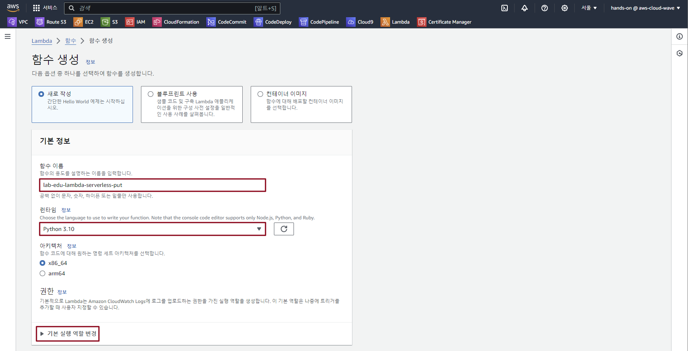
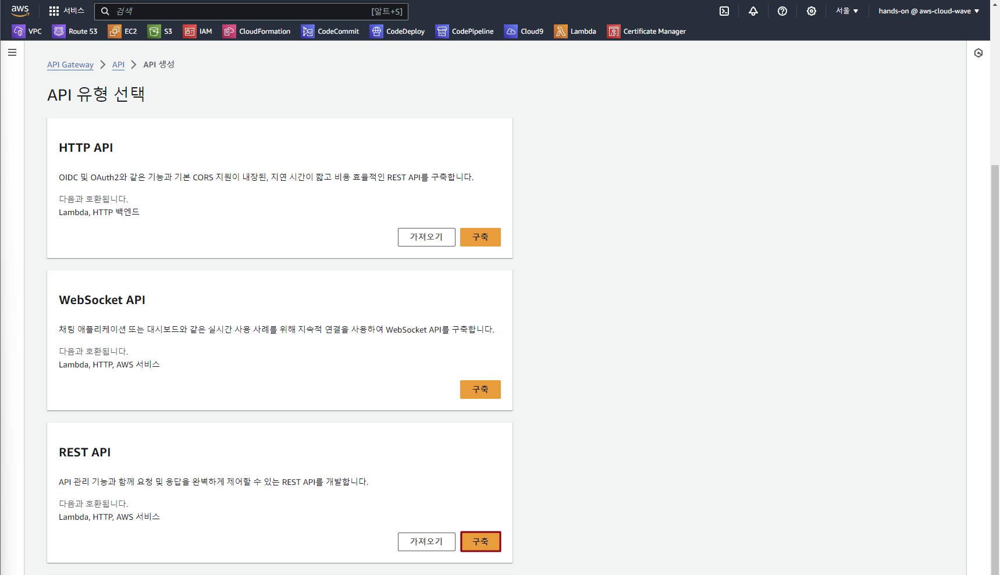
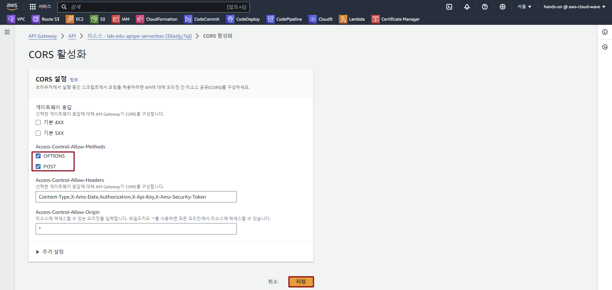
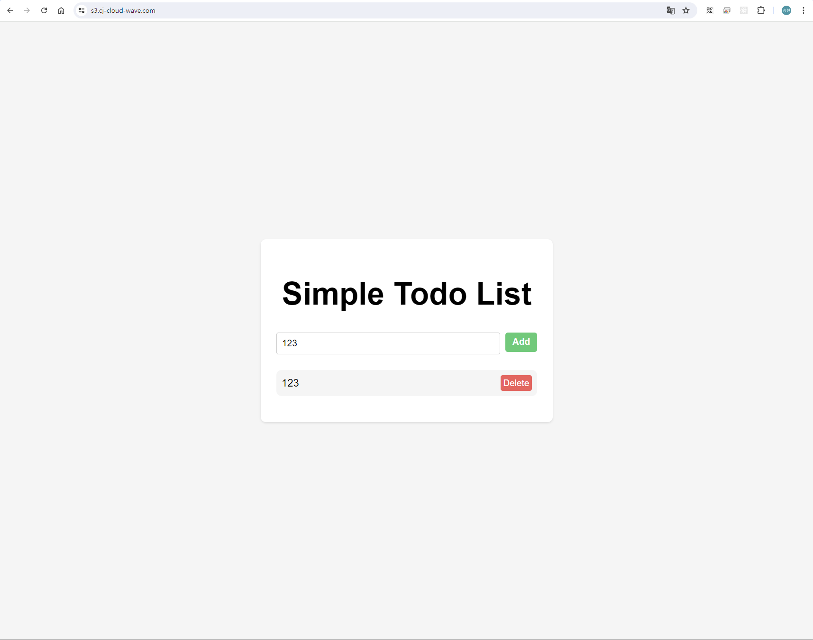

# Serverless 웹 서비스 구성

### 1. Dynamo DB 생성

- **Dynamo DB 콘솔 메인 화면 → "테이블 생성" 버튼 클릭**

- 테이블 생성 정보 입력

    - 테이블 이름: lab-edu-dynamodb-todo-list
    
    - 파티션 키: todo

    - '테이블 생성' 버튼 클릭

        

### 2. Lambda 함수 생성 및 코드 수정

- **Lambda 메인 콘솔 화면 → "함수 생성" 버튼 클릭**

- Data Insert 함수 생성 정보 입력

    - 함수 이름: lab-edu-lambda-serverless-put

    - 런타임: python 3.10

    - '기본 실행 역할 변경' 확장

        

    - 실행 역할 생성 정보 입력

        - 'AWS 정책 템플릿에서 새 역할 생성' 라디오 버튼 클릭

        - 역할 이름: lab-edu-role-lambda

        - 정책 템플릿: '단순 마이크로 서비스 권한'

            

    - '함수 생성' 버튼 클릭

- Cloud9 IDE Terminal 화면으로 이동 → 폴더 구조 확인

    ```bash
    cloud-wave-workspace/
    ├── images
    ├── scripts
    ├── serverless_code
    │   ├── css
    │   │   └── style.css
    │   ├── images
    │   │   └── cj-olivenetworks.png
    │   ├── index.html
    │   ├── lambda
    │   │   ├── lab-edu-lambda-event-handler.py
    │   │   ├── lab-edu-lambda-serverless_delete.py
    │   │   └── lab-edu-lambda-serverless_put.py
    │   └── src
    │       └── script.js
    └── support_files
    ```

- 'serverless_code/lambda' 폴더의 'lab-edu-lambda-serverless_put.py' 파일 열기 → 코드 복사

    ```python
    import json
    import boto3
    from botocore.exceptions import ClientError

    # DynamoDB 리소스 초기화
    dynamodb = boto3.resource('dynamodb')
    table = dynamodb.Table('lab-edu-dynamodb-todo-list')  # DynamoDB 테이블 이름으로 대체

    def lambda_handler(event, context):
        try:
            todo = event['todo']
        except (KeyError, TypeError, json.JSONDecodeError):
            return {
                'statusCode': 400,
                'body': json.dumps('Invalid request')
            }
        table.put_item(Item={'todo': todo})    
        
        try:
            response = table.scan()
            items = response['Items']
            print(items)
            data = {
                'statusCode': 200,
                'headers': {'Access-Control-Allow-Origin': '*'},
                'body': json.dumps(items)
            }
            return data
        except Exception as e:
            return {
                'statusCode': 500,
                'body': json.dumps('Error retrieving data from DynamoDB: ' + str(e))
            }
    ```

- **Lambda 메인 콘솔 화면 → "lab-edu-lambda-serverless-put" 선택 → 코드 소스 항목에 붙여넣기 → 'Deploy' 버튼 클릭**

    

- **Lambda 메인 콘솔 화면 → "함수 생성" 버튼 클릭**

- Data Delete 함수 생성 정보 입력

    - 함수 이름: lab-edu-lambda-serverless-delete

    - 런타임: python 3.10

    - '기본 실행 역할 변경' 확장

    - 실행 역할 생성 정보 입력

        - '기존 역할 사용' 라디오 버튼 클릭

        - 역할 이름: lab-edu-role-lambda

    - '함수 생성' 버튼 클릭

- Cloud9 IDE Terminal 화면으로 이동 → 폴더 구조 확인

    ```bash
    cloud-wave-workspace/
    ├── images
    ├── scripts
    ├── serverless_code
    │   ├── css
    │   │   └── style.css
    │   ├── images
    │   │   └── cj-olivenetworks.png
    │   ├── index.html
    │   ├── lambda
    │   │   ├── lab-edu-lambda-event-handler.py
    │   │   ├── lab-edu-lambda-serverless_delete.py
    │   │   └── lab-edu-lambda-serverless_put.py
    │   └── src
    │       └── script.js
    └── support_files
    ```

- 'serverless_code/lambda' 폴더의 'lab-edu-lambda-serverless_delete.py' 파일 열기 → 코드 복사

    ```python
    import json
    import boto3

    # DynamoDB 초기화
    dynamodb = boto3.resource('dynamodb')
    table = dynamodb.Table('lab-edu-dynamodb-todo-list')

    def lambda_handler(event, context):
        try:
            # 요청 본문에서 삭제할 항목의 키 추출
            todo = event['todo']

            # DynamoDB에서 항목 삭제
            table.delete_item(
                Key={'todo': todo}
            )

            return {
                'statusCode': 200,
                'body': json.dumps('Item deleted successfully')
            }
        except Exception as e:
            return {
                'statusCode': 500,
                'body': json.dumps('Error deleting item')
            }
    ```

- **Lambda 메인 콘솔 화면 → "lab-edu-lambda-serverless-delete" 선택 → 코드 소스 항목에 붙여넣기 → 'Deploy' 버튼 클릭**

### 3. API Gateway 생성

- **API Gateway 메인 콘솔 화면 → REST API 영역의 "구축" 버튼 클릭**

    

- REST API 생성 정보 입력

    - '새 API' 라디오 버튼 클릭

    - API 이름: lab-edu-apigw-serverless

    - 'API 생성' 버튼 클릭

        

- '리소스 생성' 버튼 클릭

    

- 리소스 생성 정보 입력

    - 리소스 이름: insert

    - '오리진 간 리소스 공유(CORS)' 체크박스 클릭

    - '리소스 생성' 버튼 클릭

        

- '메서드 생성' 버튼 클릭

    

- 메서드 생성 정보 입력

    - 메서드 유형: POST

    - 통합 유형: Lambda

    - Lamdba 함수: lab-edu-lambda-serverless-put

        

- 리소스의 '/insert' 항목 클릭 → 'CORS' 활성화 버튼 클릭

    

- Access-Control-Allow-Methods 수정
 
    - OPTION 활성화
    
    - POST 활성화 

    - '저장' 버튼 클릭

        

- 'API 배포' 버튼 클릭

    - 스테이지: new

    - 스테이지 이름: dev

        

- API 'URL 호출' 정보 복사

    

- Cloud9 IDE 화면으로 이동 → 폴더 구조 확인


    ```bash
    cloud-wave-workspace/
    ├── images
    ├── scripts
    ├── serverless_code
    │   ├── css
    │   │   └── style.css
    │   ├── images
    │   │   └── cj-olivenetworks.png
    │   ├── index.html
    │   ├── lambda
    │   │   ├── lab-edu-lambda-event-handler.py
    │   │   ├── lab-edu-lambda-serverless_delete.py
    │   │   └── lab-edu-lambda-serverless_put.py
    │   └── src
    │       └── script.js
    └── support_files
    ```

- 'serverless_code/lambda' 폴더의 'script.js' 파일 열기 → 코드 수정

    ```javascript
    document.getElementById('addBtn').addEventListener('click', addTodo)

    function addTodo() {
        const todoInput = document.getElementById('todoInput').value;

        if(todoInput) {
            fetch('{API_GATEWAAY_INSERT_URL}', {    // API 'URL 호출' 정보 붙여넣기
                method: 'POST',
                body: JSON.stringify({ todo: todoInput }),
                headers: { 'Content-Type': 'application/json' }
            })
            .then(response => response.json())
            .then(data => {
                addListItem(data.body);
            })
            .catch((error) => {
                console.error('Error:', error);
            });
        };
    };
    ```

- Cloud9 IDE Terminal 에서 S3로 변경된 소스 코드 업로드

    ```bash
    cd ~/environment/cloud-wave-workspace/serverless_code/
    aws s3 sync ./ s3://s3.{st01~30}.cj-cloud-wave.com
    ```

### 4. 웹 호스팅 접속 테스트 (http://s3.{st01~30}.cj-cloud-wave.com/ 접속)

- http://s3.{st01~30}.cj-cloud-wave.com/ 접속 → 데이터 입력 → 'Add' 버튼 클릭



- 동작하지 않는 경우 CloudFront 캐시 무효화 처리 진행

- CloudFront 콘솔 메인 화면 → 대체 도메인: 's3.cj-cloud-wave.com' 클릭 → '무효화' 탭 → '무효화 생성' 버튼 클릭

    

- '.*' 입력 → '무효화 생성' 버튼 클릭
<br><br>


# Notification 기능 구성

### 1. SNS 생성

- **SNS 콘솔 메인 화면 → 주제 이름 입력: 'lab-edu-sns-image-alarm' → "다음 단계" 버튼 클릭**

    

- 추가 설정 정보 입력 없이 '주제 생성' 버튼 클릭

- 생성 결과 화면 하단의 '구독 생성' 버튼 클릭 

    

- 구독 생성 정보 입력

    - 프로토콜: 이메일

    - 엔드포인트: 수신 Email 주소 입력 (개인 이메일 주소)

    - '구독 생성' 버튼 클릭

        

- 이메일 접속 → 'Subscription Confirmation' 메일 확인 → 'Confirm subscription' 클릭

    

### 2. Lambda 함수 생성 및 코드 수정

- **Lambda 메인 콘솔 화면 → "함수 생성" 버튼 클릭**

- Event 처리 함수 생성 정보 입력

    - 함수 이름: lab-edu-lambda-serverless-sns

    - 런타임: python 3.10

    - '기본 실행 역할 변경' 확장

    - 실행 역할 생성 정보 입력

        - 'AWS 정책 템플릿에서 새 역할 생성' 라디오 버튼 클릭

        - 역할 이름: lab-edu-role-lambda-serverless-sns

        - 정책 템플릿: 'Amazon SNS 게시 정책 (SNS)'

    - '함수 생성' 버튼 클릭

- **SNS 콘솔 메인 화면 → '주제' 탭 → 'lab-edu-sns-image-alarm' 선택 → ARN 복사**

    

- Cloud9 IDE Terminal 화면으로 이동 → 폴더 구조 확인

    ```bash
    cloud-wave-workspace/
    ├── images
    ├── scripts
    ├── serverless_code
    │   ├── css
    │   │   └── style.css
    │   ├── images
    │   │   └── cj-olivenetworks.png
    │   ├── index.html
    │   ├── lambda
    │   │   ├── lab-edu-lambda-event-handler.py
    │   │   ├── lab-edu-lambda-serverless_delete.py
    │   │   ├── lab-edu-lambda-serverless_put.py
    │   │   └── lab-edu-lambda-sns.py
    │   └── src
    │       └── script.js
    └── support_files
    ```

- 'serverless_code/lambda' 폴더의 'lab-edu-lambda-sns.py' 파일 열기 → 코드 수정 → 코드 복사

    ```python
    import json
    import boto3

    sns = boto3.client('sns')

    def lambda_handler(event, context):
        response = sns.publish(
            TopicArn = '생성한 SNS Topic 의 ARN',       # ARN 정보 입력
            Message = event['Records'][0]['s3']['object']['key'] + ' has been ' + event['Records'][0]['eventName'],
            Subject = 'S3 Event',
            )
        # TODO implement
        return {
            'statusCode': 200,
            'body': json.dumps('Hello from Lambda!')
        }
    ```

- **Lambda 메인 콘솔 화면 → "lab-edu-lambda-serverless-sns" 선택 → 코드 소스 항목에 붙여넣기 → 'Deploy' 버튼 클릭**

### 3. Lambda 함수 이벤트 트리거 설정

- **Lambda 메인 콘솔 화면 → "lab-edu-lambda-serverless-sns" 선택 → '트리거' 추가 버튼 클릭**

    

- 이벤트 트리거 생성 정보 입력

    - 소스 선택 이름: S3

    - 버킷: s3.*{st01~30}*.cj-cloud-wave.com

    - '입력과 출력 모두에 동일한 s3 버킷을 사용하는 것은...' 체크박스 활성화

    - '추가' 버튼 클릭

        

- Cloud9 IDE Terminal 화면으로 이동 → 'serverless_code/lambda' 폴더의 'index.html' 파일 열기 → 코드 수정

    ```html
    <html lang="en">
    <head>
    <meta charset="UTF-8">
    <meta name="viewport" content="width=device-width, initial-scale=1.0">
    <link rel="icon" href="./images/cj-olivenetworks.png" type="image/png"> <!-- cj-olivenetworks → google-logo 변경 -->
    <title>Serverless Application</title>
    <link rel="stylesheet" href="./css/style.css">
    </head>
    <body>
    <div class="container">
        <h1>Simple Todo List</h1>
        <div class="flex-container">
            <input type="text" id="todoInput" placeholder="Add a new todo list">
            <button id="addBtn">Add</button>
        </div>
        <script src="./src/script.js"></script>
        <ul id="todoList"></ul>
    </div>
    </body>
    </html>
    ```

- Cloud9 IDE Terminal 에서 S3로 변경된 소스 코드 업로드

    ```bash
    cd ~/environment/cloud-wave-workspace/serverless_code/
    aws s3 sync ./ s3://s3.{st01~30}.cj-cloud-wave.com
    ```

### 4. 웹 호스팅 접속 테스트 (http://s3.{st01~30}.cj-cloud-wave.com/ 접속 → 웹 사이트 로고 변경 확인)

- 웹사이트 로고 변경 확인

    

- 이메일 접속 → 'S3 Event' 메일 확인
  
    